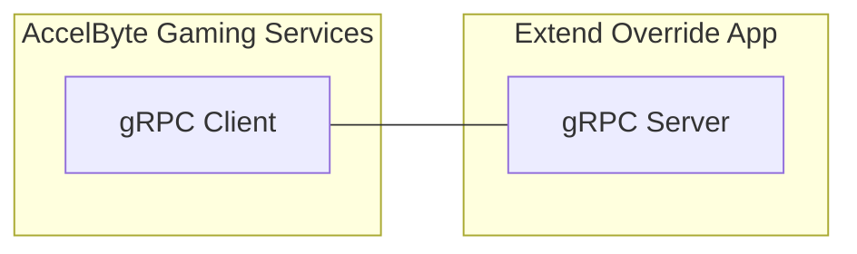

# session-manager-grpc-plugin-server-go



`AccelByte Gaming Services` (AGS) features can be customized using 
`Extend Override` apps. An `Extend Override` app is basically a `gRPC server` which 
contains one or more custom functions which can be called by AGS instead of the 
default functions.

## Overview

This repository provides a project template to create an `Extend Override` app for `session manager grpc plugin server` written in `Go`. It includes an example of how the custom functions can be implemented. It also includes the essential `gRPC server` authentication and authorization to ensure security. Additionally, it comes with built-in instrumentation for observability, ensuring that metrics, traces, and logs are available upon deployment.

You can clone this repository to begin developing your own `Extend Override` app for `session manager grpc plugin server`. Simply modify this project by implementing your own logic for the custom functions.

## Prerequisites
1. Windows 11 WSL2 or Linux Ubuntu 22.04 or macOS 14+ with the following tools installed.
   a. Bash
      ```
      bash --version

      GNU bash, version 5.1.16(1)-release (x86_64-pc-linux-gnu)
      ...
      ```

   b. Make
      - To install from Ubuntu repository, run: `sudo apt update && sudo apt install make` 

      ```
      make --version

      GNU Make 4.3
      ...
      ```

   c. Docker (Docker Engine v23.0+)
      - To install from Ubuntu repository, run: `sudo apt update && sudo apt install docker.io docker-buildx docker-compose-v2`
      - Add your user to `docker` group: `sudo usermod -aG docker $USER`
      - Log out and log back in so that the changes take effect

      ```
      docker version

      ...
      Server: Docker Desktop
       Engine:
        Version:          24.0.5
      ...
      ```

   d. Go v1.22

      - Follow [Go installation](https://go.dev/doc/install) instruction to install Go

      ```
      go version

      go version go1.22.0 ...
      ```

   e. Curl

      - To install from Ubuntu repository, run: `sudo apt update && sudo apt install curl`

      ```
      curl --version

      curl 7.81.0 (x86_64-pc-linux-gnu)
      ...
      ```

   f. Jq

      - To install from Ubuntu repository, run: `sudo apt update && sudo apt install jq`

      ```
      jq --version

      jq-1.6
      ...
      ```

   g. [Postman](https://www.postman.com/)

      - Use binary available [here](https://www.postman.com/downloads/)

    h. [ngrok](https://ngrok.com/)

      - Follow [ngrok's installation guide](https://ngrok.com/download).

    i. [extend-helper-cli](https://github.com/AccelByte/extend-helper-cli)
      - Use the available binary from [extend-helper-cli](https://github.com/AccelByte/extend-helper-cli/releases).

    > :exclamation: In macOS, you may use [Homebrew](https://brew.sh/) to easily install some of the tools above.

2. Access to AGS environment.

   a. Base URL
   
      - For `Shared Cloud` tier e.g.  https://spaceshooter.prod.gamingservices.accelbyte.io
      - For `Private Cloud` tier e.g.  https://dev.accelbyte.io
      
   b. [Create a Game Namespace](https://docs.accelbyte.io/gaming-services/services/access/namespaces/manage-your-namespaces/#create-a-game-namespace) if you don't have one yet. Keep the `Namespace ID`.

   c. [Create an OAuth Client](https://docs.accelbyte.io/gaming-services/services/access/authorization/manage-access-control-for-applications/#create-an-iam-client) with confidential client type. Keep the `Client ID` and `Client Secret`.

## Setup

To be able to run this app, you will need to follow these setup steps.

1. Create a docker compose `.env` file by copying the content of 
   [.env.template](.env.template) file.

   > :warning: **The host OS environment variables have higher precedence compared to `.env` file variables**: If the variables in `.env` file do not seem to take 
   effect properly, check if there are host OS environment variables with the 
   same name. See documentation about 
   [docker compose environment variables precedence](https://docs.docker.com/compose/how-tos/environment-variables/envvars-precedence/) 
   for more details.

2. Fill in the required environment variables in `.env` file as shown below.

   ```
   AB_BASE_URL=https://test.accelbyte.io     # Base URL of AccelByte Gaming Services environment
   AB_CLIENT_ID='xxxxxxxxxx'                 # Client ID from the Prerequisites section
   AB_CLIENT_SECRET='xxxxxxxxxx'             # Client Secret from the Prerequisites section
   AB_NAMESPACE='xxxxxxxxxx'                 # Namespace ID from the Prerequisites section
   PLUGIN_GRPC_SERVER_AUTH_ENABLED=false     # Enable or disable access token validation
   ```

   > :exclamation: **In this app, PLUGIN_GRPC_SERVER_AUTH_ENABLED is `true` by default**: If it is set to `false`, the `gRPC server` can be invoked without an AGS access 
   token. This option is provided for development purpose only. It is 
   recommended to enable `gRPC server` access token validation in production 
   environment.

## Building

To build this app, use the following command.

```
make build
```

## Running

To (build and) run this app in a container, use the following command.

```
docker compose up --build
```

## Testing

### Test in Local Development Environment

> :warning: **To perform the following, make sure PLUGIN_GRPC_SERVER_AUTH_ENABLED is set to `false`**: Otherwise,
the gRPC request will be rejected by the `gRPC server`.

The custom functions in this app can be tested locally using [postman](https://www.postman.com/).

1. Run this app by using the command below.

   ```shell
   docker compose up --build
   ```

2. Open `postman`, create a new `gRPC request`, and enter `localhost:6565` as server URL.

   > :warning: **If you are running [grpc-plugin-dependencies](https://github.com/AccelByte/grpc-plugin-dependencies) stack alongside this project as mentioned in [Test Observability](#test-observability)**: Use `localhost:10000` instead of `localhost:6565`. This way, the `gRPC server` will be called via `Envoy` service within `grpc-plugin-dependencies` stack instead of directly.

3. In `postman`, continue by selecting `OnSessionCreated` grpc call method and click `Invoke` button, this will start stream connection to the gRPC server.

4. Still in `postman`, continue sending parameters first to specify number of players in a match by copying sample `JSON` below and click `Send`.

   ```json
   {
    "session": {
        "session": {
            "id": "sessionid",
            "is_active": true,
            "namespace": "namespace",
            "created_by": "created_by"
         }
      }
   }
   ```

   Expected response when success the session will be returned back but will added `attributes` field like below:

   ```json
   {
    "session": {
        "session": {
            "id": "sessionid",
            "is_active": true,
            "namespace": "namespace",
            "created_by": "created_by",
            "attributes": {
                "SAMPLE": "value from GRPC server"
            }
         }
      }
   }
   ```

### Test with AccelByte Gaming Services

For testing this app which is running locally with AGS, the `gRPC server` needs to be exposed to the internet. To do this without requiring public IP, we can use something like [ngrok](https://ngrok.com/).

1. Run this app by using command below.

   ```shell
   docker compose up --build
   ```

2. Sign-in/sign-up to [ngrok](https://ngrok.com/) and get your auth token in `ngrok` dashboard.

3. In this app root directory, run the following helper command to expose `gRPC server` port in local development environment to the internet. Take a note of the `ngrok` forwarding URL e.g. `http://0.tcp.ap.ngrok.io:xxxxx`.

   ```
   make ngrok NGROK_AUTHTOKEN=xxxxxxxxxxx
   ```

   > :warning: **If you are running [grpc-plugin-dependencies](https://github.com/AccelByte/grpc-plugin-dependencies) stack alongside this app as mentioned in [Test Observability](#test-observability)**: Run the above 
   command in `grpc-plugin-dependencies` directory instead of this app directory.

4. in admin portal go to -> Multiplayer > Matchmaking > Session Configuration. Click on the Add Session Template button. Select the Server configuration to be a DS - Custom. Then, select the Custom URL option and provide the ngrok forwarding URL from step 3.

5. create gamesession via [end point](https://docs.accelbyte.io/api-explorer/#Session/createGameSession) with simple json body:

   ```json
   {
      "configurationName": "<your-session-template>"
   }
   ```

6. Check the result in Admin portal -> Multiplayer -> Sessions and Parties. Check in session detail that created by number 5 and we will have session with `attributes` with key `SAMPLE` and value is `value from GRPC server`

   ```json
   {
      ...
      "id": "e99542476f924d5aa5166a3d83932056",
      "namespace": "<your-namespace>",
      "createdAt": "2024-09-19T01:50:10.999Z",
      "attributes": {
         "SAMPLE": "value from GRPC server"
      },
      ...
   }
   ```

> :warning: **Ngrok free plan has some limitations**: You may want to use paid plan if the traffic is high.

## Deploying

After done testing, you may want to deploy this app to `AccelByte Gaming Services`.

1. [Create a new Extend Override App on Admin Portal](https://docs.accelbyte.io/gaming-services/services/extend/override/getting-started-with-cloudsave-validator-customization/#create-the-extend-app). Keep the `Repository URI`.

2. Download and setup [extend-helper-cli](https://github.com/AccelByte/extend-helper-cli/) (only if it has not been done previously).

3. Perform docker login with `extend-helper-cli` using the following command.

   ```
   extend-helper-cli dockerlogin --namespace <my-namespace> --app <my-app> --login
   ```

   > :exclamation: For your convenience, the above `extend-helper-cli` command can also be 
   copied from `Repository Authentication Command` under the corresponding app detail page.

4. Build and push app docker image to AccelByte ECR using the following command.
   
   ```
   extend-helper-cli image-upload --work-dir <my-project-dir> --namespace <my-namespace> -f Dockerfile --app <my-app> --image-tag v0.0.1
   ```

   > :warning: Make sure to perform docker login (step 3) before executing the above command.

5. Open Admin Portal, go to **Extend** -> **Overridable Features**. And then select the extend app.

6. To deploy selected image tag, click **Image Version History** and select desired image tag to be deployed.

7. Click **Deploy Image**, confirm the deployment and go back to App Detail by clicking **Cancel**.

8. Wait until app status is running.

### Test Observability

To be able to see the how the observability works in this app locally, there are few things that need be setup before performing tests.

1. Uncomment loki logging driver in [docker-compose.yaml](docker-compose.yaml)

   ```
    # logging:
    #   driver: loki
    #   options:
    #     loki-url: http://host.docker.internal:3100/loki/api/v1/push
    #     mode: non-blocking
    #     max-buffer-size: 4m
    #     loki-retries: "3"
   ```

   > :warning: **Make sure to install docker loki plugin beforehand**: Otherwise,
   this project will not be able to run. This is required so that container logs
   can flow to the `loki` service within `grpc-plugin-dependencies` stack. 
   Use this command to install docker loki plugin: `docker plugin install grafana/loki-docker-driver:latest --alias loki --grant-all-permissions`.

2. Clone and run [grpc-plugin-dependencies](https://github.com/AccelByte/grpc-plugin-dependencies) stack alongside this project. After this, Grafana 
will be accessible at http://localhost:3000.

   ```
   git clone https://github.com/AccelByte/grpc-plugin-dependencies.git
   cd grpc-plugin-dependencies
   docker-compose up
   ```

   > :exclamation: More information about [grpc-plugin-dependencies](https://github.com/AccelByte/grpc-plugin-dependencies) is available [here](https://github.com/AccelByte/grpc-plugin-dependencies/blob/main/README.md).

3. Perform testing. For example, by following [Test in Local Development Environment](#test-in-local-development-environment) or [Test with AccelByte Gaming Services](#test-with-accelbyte-gaming-services).

## Next Step

Proceed to modify this project template and implement your own custom functions.
